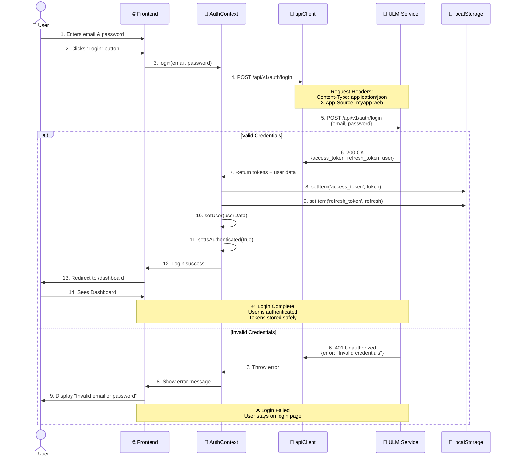

# Sequence Diagram: Login Flow (Happy Path)

## תיאור

זרימת התחברות מלאה - מהרגע שהמשתמש לוחץ "Login" ועד שהוא רואה את ה-Dashboard.

---

## Diagram



---

## Step-by-Step Explanation

### Phase 1: User Input (Steps 1-3)
1. User enters email and password
2. User clicks "Login" button
3. Frontend calls `AuthContext.login()` function

### Phase 2: API Call (Steps 4-5)
4. AuthContext uses apiClient to make POST request
5. apiClient adds headers (`X-App-Source`) and forwards to ULM

### Phase 3: ULM Validation (Step 6)
6. ULM validates credentials:
   - ✅ Valid → Return tokens + user data
   - ❌ Invalid → Return 401 error

### Phase 4: Success Path (Steps 7-14)
7. API returns tokens to AuthContext
8-9. AuthContext saves tokens to localStorage
10-11. AuthContext updates React state
12-13. Frontend redirects user to dashboard
14. User sees protected content

### Phase 4b: Error Path (Steps 7-9)
7. API throws error
8. AuthContext catches and passes to UI
9. User sees error message, stays on login page

---

## Key Points

### Security
- ✅ Password sent over HTTPS only
- ✅ Tokens stored in localStorage (encrypted on disk by browser)
- ✅ No password logged or stored client-side

### Headers
```http
POST /api/v1/auth/login HTTP/1.1
Host: ulm.ovu.co.il
Content-Type: application/json
X-App-Source: myapp-web

{
  "email": "user@example.com",
  "password": "********"
}
```

### Response
```json
{
  "success": true,
  "data": {
    "access_token": "eyJhbGciOiJIUzI1NiIsInR5cCI6IkpXVCJ9...",
    "refresh_token": "eyJhbGciOiJIUzI1NiIsInR5cCI6IkpXVCJ9...",
    "user": {
      "id": 123,
      "email": "user@example.com",
      "full_name": "John Doe",
      "role": "user"
    }
  },
  "message": "Login successful"
}
```

---

## Error Scenarios

### 1. Invalid Credentials
```json
{
  "success": false,
  "error": "Invalid email or password",
  "message": "Authentication failed"
}
```
**Response:** 401 Unauthorized
**UI:** Show error message below form

### 2. Network Error
**Scenario:** ULM server down or network timeout
**Response:** No response (timeout after 10s)
**UI:** Show "Unable to connect. Please try again."

### 3. Rate Limiting
```json
{
  "success": false,
  "error": "Too many login attempts",
  "message": "Please try again in 5 minutes"
}
```
**Response:** 429 Too Many Requests
**UI:** Show lockout message with countdown

---

## Testing Checklist

- [ ] Valid credentials → successful login
- [ ] Invalid email → show error
- [ ] Invalid password → show error
- [ ] Empty fields → show validation errors
- [ ] Network error → show connection error
- [ ] Rate limited → show lockout message
- [ ] Tokens saved to localStorage
- [ ] User state updated in AuthContext
- [ ] Redirect to dashboard after login

---

## Related Flows

- [002-refresh-token-flow](./002-refresh-token-flow.md) - What happens when token expires
- [003-logout-flow](./003-logout-flow.md) - How user logs out
- [004-401-error-handling](./004-401-error-handling.md) - Handling token expiration

---

## Code References

- Frontend: `src/contexts/AuthContext.tsx`
- API Client: `src/api/apiClient.ts`
- Login Component: `src/pages/Login.tsx`
- ADR: [001-session-management-strategy](../decisions/001-session-management-strategy.md)

