# Sequence Diagram: Refresh Token Flow (with Queue)

## תיאור

זרימת refresh token כולל טיפול ב-**race conditions** - מה קורה כאשר מספר API calls נכשלים עם 401 **בו-זמנית**.

זה התהליך הכי קריטי והמורכב!

---

## Diagram

```mermaid
sequenceDiagram
    actor User as 👤 User
    participant Frontend as 🌐 Frontend
    participant API1 as 📞 API Call #1
    participant API2 as 📞 API Call #2
    participant API3 as 📞 API Call #3
    participant Interceptor as 🔄 Response Interceptor
    participant RefreshQueue as 📋 Refresh Queue
    participant ULM as 🔐 ULM Service
    participant Storage as 💾 localStorage

    Note over User,Storage: Scenario: Access token expired<br/>User makes 3 API calls simultaneously

    User->>Frontend: 1. Opens dashboard (3 API calls triggered)

    par Concurrent API Calls
        Frontend->>API1: GET /api/v1/users
        Frontend->>API2: GET /api/v1/products
        Frontend->>API3: GET /api/v1/orders
    end

    Note over API1,ULM: All 3 calls use expired access token

    par All get 401
        API1->>ULM: 2a. Request with expired token
        API2->>ULM: 2b. Request with expired token
        API3->>ULM: 2c. Request with expired token

        ULM->>API1: 3a. 401 Unauthorized
        ULM->>API2: 3b. 401 Unauthorized
        ULM->>API3: 3c. 401 Unauthorized
    end

    API1->>Interceptor: 4a. Handle 401 (FIRST!)

    Note over Interceptor: Check: isRefreshing?<br/>No → Start refresh<br/>Set isRefreshing = true

    Interceptor->>RefreshQueue: 4b. isRefreshing = true
    Interceptor->>Storage: 5. Get refresh_token
    Interceptor->>ULM: 6. POST /api/v1/auth/refresh<br/>{refresh_token}

    API2->>Interceptor: 7a. Handle 401 (SECOND)
    API3->>Interceptor: 7b. Handle 401 (THIRD)

    Note over Interceptor,RefreshQueue: Check: isRefreshing?<br/>Yes → Add to queue<br/>Wait for refresh to complete

    Interceptor->>RefreshQueue: 8. Add API2 to queue
    Interceptor->>RefreshQueue: 9. Add API3 to queue

    alt Refresh Success
        ULM->>Interceptor: 10. 200 OK<br/>{access_token, refresh_token}

        Interceptor->>Storage: 11. Update access_token
        Interceptor->>Storage: 12. Update refresh_token (if changed)

        Interceptor->>RefreshQueue: 13. Notify all waiting requests
        Interceptor->>RefreshQueue: 14. isRefreshing = false

        Note over Interceptor,RefreshQueue: Queue processes:<br/>1. Retry API1 with new token<br/>2. Retry API2 with new token<br/>3. Retry API3 with new token

        par Retry All Calls
            Interceptor->>ULM: 15a. GET /users (new token)
            RefreshQueue->>ULM: 15b. GET /products (new token)
            RefreshQueue->>ULM: 15c. GET /orders (new token)
        end

        par All Succeed
            ULM->>API1: 16a. 200 OK + users data
            ULM->>API2: 16b. 200 OK + products data
            ULM->>API3: 16c. 200 OK + orders data
        end

        API1->>Frontend: 17a. Return users
        API2->>Frontend: 17b. Return products
        API3->>Frontend: 17c. Return orders

        Frontend->>User: 18. Display dashboard (seamless!)

        Note over User,Storage: ✅ Success!<br/>User didn't notice anything<br/>All requests completed

    else Refresh Failed (Token Expired)
        ULM->>Interceptor: 10. 401 Unauthorized<br/>{error: "Refresh token expired"}

        Interceptor->>Storage: 11. Clear all tokens
        Interceptor->>RefreshQueue: 12. Reject all queued requests
        Interceptor->>RefreshQueue: 13. isRefreshing = false

        Interceptor->>Frontend: 14. Redirect to /login
        Frontend->>User: 15. Show login page<br/>"Session expired, please login"

        Note over User,Storage: ❌ Session Expired<br/>User must log in again
    end
```



---

## Critical Points

### 1. Race Condition Handling

**Problem:** Without queue, all 3 API calls would try to refresh simultaneously:
```
API1: Call refresh → Get new token
API2: Call refresh → Get new token (DUPLICATE!)
API3: Call refresh → Get new token (DUPLICATE!)
```

**Solution:** Refresh Queue
```
API1: Start refresh, set flag
API2: See flag=true, add to queue, wait
API3: See flag=true, add to queue, wait

Refresh completes → notify ALL waiting requests
```

### 2. The `isRefreshing` Flag

```typescript
let isRefreshing = false; // Global flag

if (error.response?.status === 401) {
  if (isRefreshing) {
    // Wait for ongoing refresh
    return new Promise((resolve) => {
      refreshSubscribers.push((token) => {
        resolve(retryRequest(originalRequest, token));
      });
    });
  } else {
    // Start new refresh
    isRefreshing = true;
    // ... do refresh ...
    isRefreshing = false;
  }
}
```

### 3. The Queue Mechanism

```typescript
let refreshSubscribers: Array<(token: string) => void> = [];

// When request waits
refreshSubscribers.push((newToken) => {
  // This will be called when refresh completes
  retryRequestWithNewToken(newToken);
});

// When refresh completes
refreshSubscribers.forEach((callback) => {
  callback(newAccessToken); // Notify all waiting
});
refreshSubscribers = []; // Clear queue
```

---

## Step-by-Step Explanation

### Phase 1: Concurrent Requests (Steps 1-3)
1. User opens dashboard
2. Frontend makes 3 API calls simultaneously
3. All get 401 (token expired)

### Phase 2: First 401 Handler (Steps 4-6)
4. First API call reaches interceptor
5. Checks: `isRefreshing === false` → Starts refresh
6. Calls ULM refresh endpoint

### Phase 3: Subsequent 401s (Steps 7-9)
7-8. API2 and API3 reach interceptor
9. Both see `isRefreshing === true` → Added to queue

### Phase 4a: Success Path (Steps 10-18)
10. ULM returns new tokens
11-12. Tokens saved to localStorage
13-14. Queue notified, all requests retry
15-17. All requests succeed with new token
18. User sees dashboard (seamless experience)

### Phase 4b: Failure Path (Steps 10-15)
10. ULM rejects refresh (token expired)
11. Clear all tokens
12-13. Reject all queued requests
14-15. Redirect to login page

---

## Code Implementation

```typescript
// api/apiClient.ts
import axios from 'axios';

const api = axios.create({
  baseURL: import.meta.env.VITE_API_BASE_URL,
});

let isRefreshing = false;
let refreshSubscribers: Array<(token: string) => void> = [];

const subscribeTokenRefresh = (cb: (token: string) => void) => {
  refreshSubscribers.push(cb);
};

const onRefreshed = (token: string) => {
  refreshSubscribers.forEach((cb) => cb(token));
  refreshSubscribers = [];
};

api.interceptors.response.use(
  (response) => response,
  async (error) => {
    const originalRequest = error.config;

    if (error.response?.status === 401 && !originalRequest._retry) {
      if (isRefreshing) {
        // Wait for refresh to complete
        return new Promise((resolve) => {
          subscribeTokenRefresh((token: string) => {
            originalRequest.headers.Authorization = `Bearer ${token}`;
            resolve(api(originalRequest));
          });
        });
      }

      originalRequest._retry = true;
      isRefreshing = true;

      try {
        const refreshToken = localStorage.getItem('refresh_token');
        const { data } = await axios.post(
          `${import.meta.env.VITE_ULM_URL}/api/v1/auth/refresh`,
          { refresh_token: refreshToken },
          {
            headers: {
              'X-App-Source': import.meta.env.VITE_APP_SOURCE,
            },
          }
        );

        const newAccessToken = data.data.access_token;
        localStorage.setItem('access_token', newAccessToken);

        // Notify all waiting requests
        onRefreshed(newAccessToken);
        isRefreshing = false;

        // Retry original request
        originalRequest.headers.Authorization = `Bearer ${newAccessToken}`;
        return api(originalRequest);
      } catch (refreshError) {
        isRefreshing = false;
        refreshSubscribers = [];

        // Refresh failed → logout
        localStorage.clear();
        window.location.href = '/login';
        return Promise.reject(refreshError);
      }
    }

    return Promise.reject(error);
  }
);

export default api;
```

---

## Testing Scenarios

### Test 1: Single 401
```typescript
it('should refresh token on 401', async () => {
  // Mock expired token
  // Make API call → 401
  // Verify refresh called once
  // Verify original request retried
  // Verify success
});
```

### Test 2: Concurrent 401s (Critical!)
```typescript
it('should handle concurrent 401s with queue', async () => {
  // Mock expired token
  // Make 3 API calls simultaneously
  // All get 401
  // Verify refresh called ONLY ONCE
  // Verify all 3 requests retried
  // Verify all succeed
});
```

### Test 3: Refresh Failure
```typescript
it('should logout on refresh failure', async () => {
  // Mock expired refresh token
  // Make API call → 401
  // Refresh fails → 401
  // Verify localStorage cleared
  // Verify redirect to /login
});
```

---

## Performance Metrics

| Metric | Target | Notes |
|--------|--------|-------|
| Refresh time | < 500ms | From 401 to retry |
| Queue wait time | < 100ms | After refresh completes |
| Max concurrent requests | 50 | Before performance degrades |

---

## Common Issues & Solutions

### Issue 1: Infinite Refresh Loop

**Symptom:** Refresh keeps calling itself
**Cause:** `originalRequest._retry` not set
**Solution:** Always set flag to prevent retry

```typescript
originalRequest._retry = true; // ← CRITICAL!
```

### Issue 2: Queue Never Cleared

**Symptom:** Old requests still in queue
**Cause:** Forgot to clear subscribers
**Solution:** Always clear after processing

```typescript
refreshSubscribers = []; // ← CRITICAL!
```

### Issue 3: Race Condition Still Happens

**Symptom:** Multiple refresh calls
**Cause:** `isRefreshing` check not atomic
**Solution:** Check before AND after async operations

---

## Related Flows

- [001-login-flow](./001-login-flow.md) - How tokens are created
- [004-401-error-handling](./004-401-error-handling.md) - Full error handling
- [003-logout-flow](./003-logout-flow.md) - Cleanup on logout

---

## References

- [OAuth 2.0 Refresh Token](https://tools.ietf.org/html/rfc6749#section-6)
- [ADR-001: Session Management](../decisions/001-session-management-strategy.md)

