# Sequence Diagram: Logout Flow

## תיאור

זרימת logout מלאה - ניקוי tokens, state, והחזרה ל-login page.

---

## Diagram

```mermaid
sequenceDiagram
    actor User as 👤 User
    participant Frontend as 🌐 Frontend
    participant AuthContext as 🔄 AuthContext
    participant API as 🔧 apiClient
    participant ULM as 🔐 ULM Service
    participant Storage as 💾 localStorage
    participant Router as 🔀 React Router

    User->>Frontend: 1. Clicks "Logout" button

    Frontend->>AuthContext: 2. logout()

    Note over AuthContext: Start cleanup process

    AuthContext->>Storage: 3. Get refresh_token

    alt Notify Server (Optional - Best Practice)
        AuthContext->>API: 4. POST /api/v1/auth/logout
        API->>ULM: 5. POST /api/v1/auth/logout<br/>{refresh_token}

        Note over ULM: ULM invalidates refresh token<br/>(adds to blacklist)

        ULM->>API: 6. 200 OK<br/>{message: "Logged out"}
        API->>AuthContext: 7. Success
    end

    Note over AuthContext: Clean up client-side<br/>(even if server call fails)

    AuthContext->>Storage: 8. removeItem('access_token')
    AuthContext->>Storage: 9. removeItem('refresh_token')
    AuthContext->>Storage: 10. removeItem('user')

    Note over Storage: Could also use:<br/>localStorage.clear()

    AuthContext->>AuthContext: 11. setUser(null)
    AuthContext->>AuthContext: 12. setIsAuthenticated(false)

    AuthContext->>Frontend: 13. Logout complete

    Frontend->>Router: 14. navigate('/login')

    Router->>User: 15. Show login page

    Note over User,Storage: ✅ Logged Out<br/>All tokens cleared<br/>State reset
```



---

## Step-by-Step Explanation

### Phase 1: User Action (Steps 1-2)
1. User clicks logout button/menu item
2. Frontend calls `AuthContext.logout()`

### Phase 2: Server Notification (Steps 3-7) [Optional]
3. Get refresh token from storage
4-5. Send logout request to ULM
6-7. ULM invalidates token (adds to blacklist)

**Note:** This is optional but recommended for security. Even if this fails, we still clean up client-side.

### Phase 3: Client Cleanup (Steps 8-12)
8-10. Remove all auth data from localStorage
11-12. Reset React state (user, isAuthenticated)

### Phase 4: Redirect (Steps 13-15)
13-15. Navigate to login page

---

## Code Implementation

### AuthContext logout()

```typescript
// contexts/AuthContext.tsx
const AuthProvider = ({ children }: { children: ReactNode }) => {
  const [user, setUser] = useState<User | null>(null);
  const navigate = useNavigate();

  const logout = async () => {
    try {
      // Optional: Notify server
      const refreshToken = localStorage.getItem('refresh_token');
      if (refreshToken) {
        await api.post('/api/v1/auth/logout', {
          refresh_token: refreshToken,
        });
      }
    } catch (error) {
      // Continue with client cleanup even if server call fails
      console.error('Logout API call failed:', error);
    } finally {
      // Always clean up client-side
      localStorage.removeItem('access_token');
      localStorage.removeItem('refresh_token');
      localStorage.removeItem('user');

      // Or: localStorage.clear();

      setUser(null);

      navigate('/login');
    }
  };

  return (
    <AuthContext.Provider value={{ user, logout, ... }}>
      {children}
    </AuthContext.Provider>
  );
};
```

### Logout Button Component

```typescript
// components/Header.tsx
import { useAuth } from '@/contexts/AuthContext';
import { useTranslation } from 'react-i18next';

const Header = () => {
  const { user, logout } = useAuth();
  const { t } = useTranslation();

  return (
    <header>
      <span>Welcome, {user?.full_name}</span>
      <button onClick={logout}>
        {t('auth.logout')}
      </button>
    </header>
  );
};
```

### ULM Logout Endpoint (Backend)

```python
# backend/app/api/auth.py
from fastapi import APIRouter, Depends
from app.core.redis import redis_client

router = APIRouter()

@router.post("/logout")
async def logout(
    refresh_token: str,
):
    """
    Logout user by invalidating refresh token.

    Adds refresh token to blacklist (Redis) so it can't be reused.
    """
    try:
        # Add to blacklist (TTL = refresh token expiry)
        await redis_client.setex(
            f"blacklist:{refresh_token}",
            value="1",
            time=7 * 24 * 60 * 60  # 7 days
        )

        return {
            "success": True,
            "message": "Logged out successfully"
        }
    except Exception as e:
        # Even if blacklisting fails, client cleanup will work
        return {
            "success": False,
            "message": "Logout completed with warnings"
        }
```

---

## Alternative: No Server Call

For simpler apps, you can skip the server logout call:

```typescript
const logout = () => {
  // Just clean up client-side
  localStorage.clear();
  setUser(null);
  navigate('/login');
};
```

**Pros:**
- ✅ Simpler
- ✅ Works offline
- ✅ No network dependency

**Cons:**
- ❌ Refresh token still valid on server
- ❌ User can reuse refresh token if stolen before logout

**Recommendation:** Include server call for production apps.

---

## Security Considerations

### 1. Token Blacklisting

**Problem:** After logout, refresh token is still valid for 7 days.

**Solution:** Server-side blacklist (Redis)

```python
# Check blacklist on every refresh
async def refresh_token(token: str):
    # Check if token is blacklisted
    is_blacklisted = await redis_client.get(f"blacklist:{token}")
    if is_blacklisted:
        raise HTTPException(401, "Token has been revoked")

    # Continue with refresh...
```

### 2. Multiple Device Logout

**Problem:** User wants to logout from ALL devices.

**Solution:** User-level token invalidation

```python
@router.post("/logout-all")
async def logout_all(
    user_id: int,
):
    """Logout user from all devices."""
    # Increment user's token version
    await db.execute(
        "UPDATE users SET token_version = token_version + 1 WHERE id = :user_id",
        {"user_id": user_id}
    )

    # All existing tokens now invalid (version mismatch)
```

### 3. Automatic Logout on Inactivity

```typescript
// hooks/useIdleTimer.ts
import { useEffect } from 'react';
import { useAuth } from '@/contexts/AuthContext';

const IDLE_TIMEOUT = 30 * 60 * 1000; // 30 minutes

export const useIdleTimer = () => {
  const { logout } = useAuth();

  useEffect(() => {
    let timeout: NodeJS.Timeout;

    const resetTimer = () => {
      clearTimeout(timeout);
      timeout = setTimeout(logout, IDLE_TIMEOUT);
    };

    // Reset on user activity
    window.addEventListener('mousemove', resetTimer);
    window.addEventListener('keypress', resetTimer);
    window.addEventListener('click', resetTimer);

    resetTimer(); // Start timer

    return () => {
      clearTimeout(timeout);
      window.removeEventListener('mousemove', resetTimer);
      window.removeEventListener('keypress', resetTimer);
      window.removeEventListener('click', resetTimer);
    };
  }, [logout]);
};
```

---

## Testing

```typescript
// __tests__/logout.test.tsx
import { render, screen, waitFor } from '@testing-library/react';
import userEvent from '@testing-library/user-event';
import { AuthProvider } from '@/contexts/AuthContext';
import Header from '@/components/Header';

describe('Logout', () => {
  it('should logout user and redirect', async () => {
    // Setup: User is logged in
    localStorage.setItem('access_token', 'token');
    localStorage.setItem('refresh_token', 'refresh');

    const { history } = render(
      <AuthProvider>
        <Header />
      </AuthProvider>
    );

    const logoutButton = screen.getByText(/logout/i);
    await userEvent.click(logoutButton);

    await waitFor(() => {
      // Verify localStorage cleared
      expect(localStorage.getItem('access_token')).toBeNull();
      expect(localStorage.getItem('refresh_token')).toBeNull();

      // Verify redirect
      expect(history.location.pathname).toBe('/login');
    });
  });

  it('should handle server logout failure gracefully', async () => {
    // Mock server error
    jest.spyOn(api, 'post').mockRejectedValue(new Error('Network error'));

    render(
      <AuthProvider>
        <Header />
      </AuthProvider>
    );

    const logoutButton = screen.getByText(/logout/i);
    await userEvent.click(logoutButton);

    await waitFor(() => {
      // Even if server call fails, client should be cleaned
      expect(localStorage.getItem('access_token')).toBeNull();
    });
  });
});
```

---

## Common Issues

### Issue 1: User Still Sees Protected Content

**Cause:** React state not updated
**Solution:** Ensure `setUser(null)` is called

### Issue 2: User Can Go Back to Dashboard

**Cause:** Protected route not checking auth
**Solution:** Use `ProtectedRoute` wrapper

```typescript
// routes/ProtectedRoute.tsx
const ProtectedRoute = ({ children }: { children: ReactNode }) => {
  const { isAuthenticated } = useAuth();

  if (!isAuthenticated) {
    return <Navigate to="/login" replace />;
  }

  return <>{children}</>;
};
```

### Issue 3: Refresh Token Still Works After Logout

**Cause:** No server-side blacklist
**Solution:** Implement token blacklist (Redis)

---

## Related Flows

- [001-login-flow](./001-login-flow.md) - Opposite of logout
- [002-refresh-token-flow](./002-refresh-token-flow.md) - Token lifecycle
- [004-401-error-handling](./004-401-error-handling.md) - Forced logout on error

---

## References

- [OAuth 2.0 Token Revocation](https://tools.ietf.org/html/rfc7009)
- [OWASP Session Management](https://owasp.org/www-project-web-security-testing-guide/latest/4-Web_Application_Security_Testing/06-Session_Management_Testing/01-Testing_for_Session_Management_Schema)

