# Sequence Diagram: 401 Error Handling (Complete Flow)

## תיאור

זרימה מלאה של טיפול ב-401 error - כולל refresh success ו-failure scenarios.

זה שילוב של flows 002 ו-003, מציג את התמונה המלאה.

---

## Diagram

```mermaid
sequenceDiagram
    actor User as 👤 User
    participant Frontend as 🌐 Frontend
    participant API as 🔧 apiClient
    participant Interceptor as 🔄 401 Interceptor
    participant ULM as 🔐 ULM Service
    participant Storage as 💾 localStorage

    User->>Frontend: 1. Interact with app
    Frontend->>API: 2. GET /api/v1/data
    API->>ULM: 3. Request with token

    Note over ULM: Token validation

    alt Token Valid
        ULM->>API: 4a. 200 OK + data
        API->>Frontend: 5a. Return data
        Frontend->>User: 6a. Show content

        Note over User,Storage: ✅ Success - No issues

    else Token Expired
        ULM->>API: 4b. 401 Unauthorized
        API->>Interceptor: 5b. Handle 401

        Note over Interceptor: Check: isRefreshing?

        alt Not Currently Refreshing
            Interceptor->>Interceptor: 6. Set isRefreshing = true
            Interceptor->>Storage: 7. Get refresh_token
            Interceptor->>ULM: 8. POST /auth/refresh

            alt Refresh Token Valid
                ULM->>Interceptor: 9a. 200 OK + new tokens
                Interceptor->>Storage: 10a. Save new tokens
                Interceptor->>Interceptor: 11a. Notify queue
                Interceptor->>Interceptor: 12a. isRefreshing = false
                Interceptor->>ULM: 13a. Retry original request
                ULM->>API: 14a. 200 OK + data
                API->>Frontend: 15a. Return data
                Frontend->>User: 16a. Show content (seamless!)

                Note over User,Storage: ✅ Transparent Refresh<br/>User didn't notice

            else Refresh Token Expired
                ULM->>Interceptor: 9b. 401 Unauthorized
                Interceptor->>Storage: 10b. Clear all tokens
                Interceptor->>Interceptor: 11b. Reject queue
                Interceptor->>Interceptor: 12b. isRefreshing = false
                Interceptor->>Frontend: 13b. Redirect to /login
                Frontend->>User: 14b. Show "Session expired"

                Note over User,Storage: ❌ Session Expired<br/>Must log in again

            else Network Error
                Note over ULM: ULM unreachable
                Interceptor->>Interceptor: 9c. Catch error
                Interceptor->>Storage: 10c. Keep tokens (maybe temporary)
                Interceptor->>Interceptor: 11c. isRefreshing = false
                Frontend->>User: 12c. Show "Connection error"

                Note over User,Storage: ⚠️ Temporary Error<br/>Can retry later
            end

        else Currently Refreshing
            Interceptor->>Interceptor: 6. Add to queue
            Note over Interceptor: Wait for refresh to complete...
            Interceptor->>Interceptor: 7. Get notified when done
            Interceptor->>ULM: 8. Retry with new token
            ULM->>API: 9. 200 OK + data
            API->>Frontend: 10. Return data
            Frontend->>User: 11. Show content

            Note over User,Storage: ✅ Queued Request<br/>Waited for refresh
        end
    end
```



---

## Error Scenarios Matrix

| Scenario | Refresh Token | Action | Result |
|----------|--------------|--------|--------|
| **1. Token expired, refresh valid** | Valid | Auto-refresh | ✅ Continue |
| **2. Token expired, refresh expired** | Expired | Logout | ❌ Login required |
| **3. Token expired, ULM down** | Unknown | Show error | ⚠️ Retry later |
| **4. Token stolen/revoked** | Blacklisted | Logout | ❌ Security alert |
| **5. Concurrent 401s** | Valid | Queue all | ✅ Continue |

---

## Complete Code Implementation

```typescript
// api/apiClient.ts
import axios, { AxiosError } from 'axios';

const api = axios.create({
  baseURL: import.meta.env.VITE_API_BASE_URL,
  headers: {
    'Content-Type': 'application/json',
    'X-App-Source': import.meta.env.VITE_APP_SOURCE,
  },
});

// Request interceptor: Add token
api.interceptors.request.use(
  (config) => {
    const token = localStorage.getItem('access_token');
    if (token) {
      config.headers.Authorization = `Bearer ${token}`;
    }
    return config;
  },
  (error) => Promise.reject(error)
);

// Response interceptor: Handle 401
let isRefreshing = false;
let refreshSubscribers: Array<(token: string) => void> = [];

const subscribeTokenRefresh = (cb: (token: string) => void) => {
  refreshSubscribers.push(cb);
};

const onRefreshed = (token: string) => {
  refreshSubscribers.forEach((cb) => cb(token));
  refreshSubscribers = [];
};

const onRefreshFailed = () => {
  refreshSubscribers = [];
  localStorage.clear();
  window.location.href = '/login?session=expired';
};

api.interceptors.response.use(
  (response) => response,
  async (error: AxiosError) => {
    const originalRequest = error.config as any;

    // Not a 401 or already retried
    if (error.response?.status !== 401 || originalRequest._retry) {
      return Promise.reject(error);
    }

    if (isRefreshing) {
      // Another request is already refreshing, queue this one
      return new Promise((resolve, reject) => {
        subscribeTokenRefresh((token: string) => {
          originalRequest.headers.Authorization = `Bearer ${token}`;
          resolve(api(originalRequest));
        });
      });
    }

    originalRequest._retry = true;
    isRefreshing = true;

    try {
      const refreshToken = localStorage.getItem('refresh_token');

      if (!refreshToken) {
        throw new Error('No refresh token available');
      }

      const { data } = await axios.post(
        `${import.meta.env.VITE_ULM_URL}/api/v1/auth/refresh`,
        { refresh_token: refreshToken },
        {
          headers: {
            'X-App-Source': import.meta.env.VITE_APP_SOURCE,
          },
          timeout: 10000, // 10 second timeout
        }
      );

      const newAccessToken = data.data.access_token;
      const newRefreshToken = data.data.refresh_token; // May be rotated

      // Save new tokens
      localStorage.setItem('access_token', newAccessToken);
      if (newRefreshToken) {
        localStorage.setItem('refresh_token', newRefreshToken);
      }

      // Notify all waiting requests
      onRefreshed(newAccessToken);
      isRefreshing = false;

      // Retry original request
      originalRequest.headers.Authorization = `Bearer ${newAccessToken}`;
      return api(originalRequest);
    } catch (refreshError) {
      isRefreshing = false;
      onRefreshFailed();
      return Promise.reject(refreshError);
    }
  }
);

export default api;
```

---

## User Experience Matrix

| Scenario | User Sees | Duration | User Action |
|----------|-----------|----------|-------------|
| **Transparent refresh** | Loading spinner | 200-500ms | None (seamless) |
| **Session expired** | Login page + message | Immediate | Must log in |
| **Network error** | Error banner + retry | Until ULM back | Can retry |
| **Concurrent calls** | Single loading | 200-500ms | None (queued) |

---

## Advanced: Circuit Breaker Pattern

For production, add circuit breaker to prevent cascade failures:

```typescript
// utils/circuitBreaker.ts
class CircuitBreaker {
  private failureCount = 0;
  private lastFailureTime = 0;
  private state: 'CLOSED' | 'OPEN' | 'HALF_OPEN' = 'CLOSED';

  private readonly threshold = 5; // failures
  private readonly timeout = 60000; // 1 minute

  async execute<T>(fn: () => Promise<T>): Promise<T> {
    if (this.state === 'OPEN') {
      if (Date.now() - this.lastFailureTime > this.timeout) {
        this.state = 'HALF_OPEN';
      } else {
        throw new Error('Circuit breaker is OPEN');
      }
    }

    try {
      const result = await fn();
      this.onSuccess();
      return result;
    } catch (error) {
      this.onFailure();
      throw error;
    }
  }

  private onSuccess() {
    this.failureCount = 0;
    this.state = 'CLOSED';
  }

  private onFailure() {
    this.failureCount++;
    this.lastFailureTime = Date.now();

    if (this.failureCount >= this.threshold) {
      this.state = 'OPEN';
      console.error('Circuit breaker opened!');
    }
  }
}

const ulmCircuitBreaker = new CircuitBreaker();

// Use in refresh
await ulmCircuitBreaker.execute(() =>
  axios.post('/api/v1/auth/refresh', { refresh_token })
);
```

---

## Monitoring & Alerts

```typescript
// utils/monitoring.ts
export const trackAuthEvent = (event: string, metadata?: any) => {
  // Send to analytics
  analytics.track(event, {
    timestamp: Date.now(),
    user_id: localStorage.getItem('user_id'),
    ...metadata,
  });

  // Send to Sentry for errors
  if (event.includes('error') || event.includes('failed')) {
    Sentry.captureMessage(event, {
      level: 'error',
      extra: metadata,
    });
  }
};

// Use in interceptor
trackAuthEvent('token_refresh_started');
trackAuthEvent('token_refresh_success');
trackAuthEvent('token_refresh_failed', { error: refreshError.message });
trackAuthEvent('session_expired');
```

---

## Testing

```typescript
// __tests__/401Handling.test.ts
import { rest } from 'msw';
import { setupServer } from 'msw/node';
import api from '@/api/apiClient';

const server = setupServer();

beforeAll(() => server.listen());
afterEach(() => server.resetHandlers());
afterAll(() => server.close());

describe('401 Error Handling', () => {
  it('should refresh and retry on 401', async () => {
    let attemptCount = 0;

    server.use(
      rest.get('/api/v1/data', (req, res, ctx) => {
        attemptCount++;
        if (attemptCount === 1) {
          return res(ctx.status(401));
        }
        return res(ctx.json({ data: 'success' }));
      }),
      rest.post('/api/v1/auth/refresh', (req, res, ctx) => {
        return res(
          ctx.json({
            data: { access_token: 'new-token' },
          })
        );
      })
    );

    const response = await api.get('/api/v1/data');
    expect(response.data).toEqual({ data: 'success' });
    expect(attemptCount).toBe(2); // Initial + retry
  });

  it('should handle concurrent 401s', async () => {
    let refreshCount = 0;

    server.use(
      rest.get('*', (req, res, ctx) => res(ctx.status(401))),
      rest.post('/api/v1/auth/refresh', (req, res, ctx) => {
        refreshCount++;
        return res(ctx.json({ data: { access_token: 'new-token' } }));
      })
    );

    // Make 3 concurrent calls
    await Promise.all([
      api.get('/api/v1/users'),
      api.get('/api/v1/products'),
      api.get('/api/v1/orders'),
    ]).catch(() => {});

    expect(refreshCount).toBe(1); // Only one refresh!
  });
});
```

---

## Performance Considerations

| Aspect | Target | Monitoring |
|--------|--------|------------|
| Refresh latency | < 500ms (p95) | Track in APM |
| Queue size | < 50 requests | Alert if > 100 |
| Refresh failures | < 1% | Alert if > 5% |
| Session expired rate | < 10% daily | Track in analytics |

---

## Related Flows

- [001-login-flow](./001-login-flow.md)
- [002-refresh-token-flow](./002-refresh-token-flow.md)
- [003-logout-flow](./003-logout-flow.md)

---

## References

- [ADR-001: Session Management Strategy](../decisions/001-session-management-strategy.md)
- [OAuth 2.0 Token Refresh](https://tools.ietf.org/html/rfc6749#section-6)
- [Circuit Breaker Pattern](https://martinfowler.com/bliki/CircuitBreaker.html)

